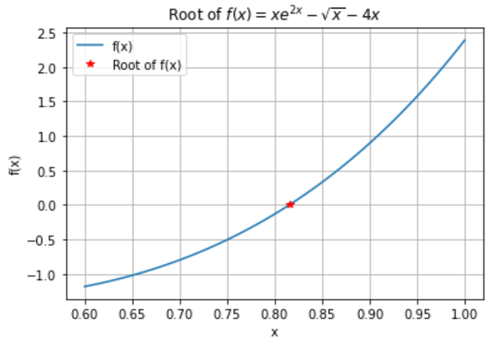

# Root Finding Methods

Numerical methods for determining the roots/zeros of a function, implemented in Python.

**Code By:** Michael Wrona | *B.S. Aerospace Engineering*

This is a collection of root-finding numerical methods implemented in Python. Included are the Bisection Method, Secant Method, and Brent's Method, all implemented as functions in their respective .py files. An example of how to use them can be found in `RootFindingExample.py`

Resources for each numerical method can be found below.

## Dependencies

- [NumPy](https://numpy.org/)
- [Matplotlib](https://matplotlib.org/)

## Resources

### Bisection Method
- [Bisection Method - Theory and Code (My Blog Site)](https://mwrona.com/posts/05-bisection-method/)
- [YouTube video by user Oscar Veliz](https://youtu.be/MlP_W-obuNg)
- [Bisection Method on Wikipedia](https://en.wikipedia.org/wiki/Bisection_method)
- [Bisection Method Example on AtoZMath.com](https://atozmath.com/example/CONM/Bisection.aspx?he=e&q=bi)
- 
### Secant Method

- [Secant Method on Wikipedia](https://en.wikipedia.org/wiki/Secant_method)
- [The Secant Method by Dr. Weimin Han, Professor, University of Iowa](http://homepage.math.uiowa.edu/~whan/3800.d/S3-3.pdf)
- [YouTube video by user ar Veliz](https://www.youtube.com/watch?v=_MfjXOLUnyw)

### Brent's Method

- [YouTube video by user Oscar Veliz](https://youtu.be/-bLSRiokgFk)
- [Brent's Method implemented in Julia](https://mmas.github.io/brent-julia)
- [Brent's Method on Wikipedia](https://en.wikipedia.org/wiki/Brent%27s_method)

---

## Find Me On:
- [YouTube](https://www.youtube.com/channel/UCIeZzuXHGm7zqSFvT8xGoIQ)
- [GitHub](https://github.com/michaelwro)
- [My Blog Site](https://mwrona.com/)
